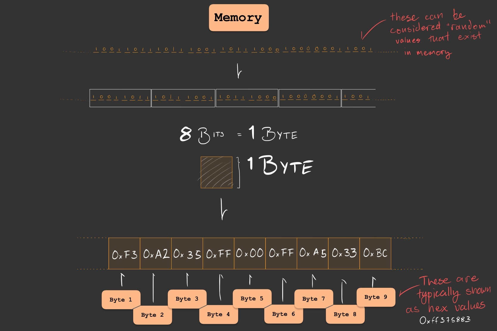
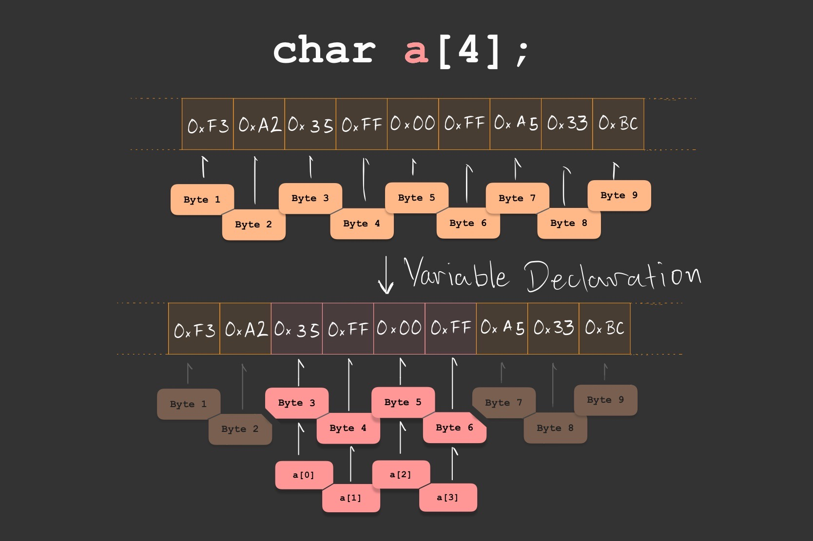
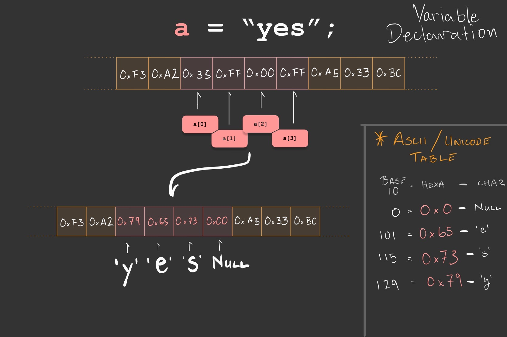

# C / C++ errors and concepts

<details>
<summary>

</summary>
<br> 

</details>


- [section: pass by reference vs. pass by value #26](https://github.com/deliaBlue/laPrepa/issues/26)
- [section: Handling errors #25](https://github.com/deliaBlue/laPrepa/issues/25)
- [section: dynamic memory allocation #24](https://github.com/deliaBlue/laPrepa/issues/24)


# Memory Allocation

Developing an understanding of how to store and manipulate information 
is one of our primary aims as programmers. 

Variables, pointers, references, functions, etc... - these are all just 
ways of organizing and managing data. 

Within the context of C / C++, we can begin to develop an understanding
of how these abstract things behave by understanding how they are related
to memory. Over the next academic year, you will become more intimately 
familiar with these concepts since you **will have to deal with the issues 
they present**.

This section will introduce some rudimentary concepts relating to memory 
(contextualized in the framework of C / C++) to help you start developing
your own mental model of what is happening within your code.

## Variables, Declaration, Initialization, and Assignment
Amongst the code you've had to read / write in these sessions, you've been using
variables. Regardless of the programming language you are using, being able to name
values so that you can modify and manipulate them is unbelivably useful.

Declaring, initializing, modifying, comparing, assigning - these are just some 
of the actions you've taken with the value/s stored within the variables you have 
been using.


Since C / C++ are not memory safe, you have to be conscious of what it is
you are doing when you are declaring a variable, or when you are assigning
a value to it, or adding to it, etc...

So how should we conceptualize what we are doing? Lets first get 
familiar with **memory** as it relates to **declaration**, 
**initialization**, and **assignment**.

**From here on out we are not going to be pedantic. These descriptions
are simplified and abstracted away for the sake of clarity, not accuracy.**

### Memory as it relates to variables

Memory can be thought of as a region of your computer capable of storing 
information. For our purposes, imagine a finite sequence of 0’s and 1’s.

When your program begins to execute, it is given some memory - some 0’s and 1’s 
it can use for its own temporary storage of information. 

Note that this memory already contains data which is just random
[^why it isn’t just random] and not particularly useful. 



So we have places where we can store information, which leads us to the
concept of **memory addresses**.

Your program can read and write onto the memory it has been given, and it 
will interpret the infromation stored there in whatever way you tell it to.

But the program needs to know where the information is located!
In the image above, we've named 'Byte 1', 'Byte 2', [...], 'Byte 9' and we need
something analogous to this so that the computer can identify which regions in 
memory to access.

Just like street addresses are some abstraction we use in the real world - a name
that corresponds to the location of a place - **memory locations** can be refered 
to via **addresses**!

This is known as a memory address, and its just what the name implies, a name for
a location in memory.

Whatever random data was held in memory before your program executes isn't
particularly useful for our purposes[^reading privileged information]. 

If we want to store specific information - i.e if we want to store the value of
an integer, or a string of characters, or anything at all - we have to know 
where we're storing it. 

SHOW PYTHON ERROR VARIABLE BEFORE ASSIGNMENT
SHOW C / C++ ERROR VARIABLE DECLARED BEFORE ASSIGNMENT

<details open>
<summary>

### Declaring a variable

</summary>
<br> 

When we declare a variable, we are associating whatever **name** we've 
provided with some **value**. Lets see an example:

```c++
int main(){
    int year;           // <--- Declaring a variable of type int
    year = 1342;        // <--- Assigning/Initializing the value of the variable
}
```

We are using the name **year** in our code to mean 'some integer I will 
reference as **year**' - in other words we are associating a **name** and 
a **value**. 

When this program is executed, this variable is simply the name we've given
to some region in memory - **year** is[^debugger variable names vs addresses] 
a custom name we've given to some memory location!


Lets visualize how we are **naming** a region in memory, and later on
we'll look at what **assigning a value to it** would look like given 
the following code:

```c++
int main(){
    char a[4];      // <- visual aid represents this line
    a = "yes";
}
```



`Note that there already is data inside of 'a'. Where did it come from?`


</details>


### Initializing and assigning data to a variable

We've declared a variable, in turn the compiler has allocated as much memory as
we've specified or as much memory as is default. In our case, we've specified 
that **a** is an array of 4 chars (meaning each `block` contians 1 byte since
chars have that size [^unicode, ascii, and char arrays in C / C++ caveat]) 
ergo 4 bytes will be allocated to variable **a**.

We would say that this region in memory is uninitialized because the compiler
has simply associated a user defined variable name with a memory region. We
now have to write onto that region in memory by initializing/assigning a value
onto our variable - otherwise we'll just have whatever garbage value/random bits 
were previously held in those memory locations (foreshadowing).

<details>
<summary>

#### What would happen if we printed the contents of 'a' before it is initialized?

</summary>
<br> 

</details>

To reiterate, **C / C++ do not have default values they assign to your variables
whenever you declare them**[^when they do]. You need to initialize them.

In other words, this code in C++ has **undefined behaviour** because the value 
of **a** will not always be the same:

```c++
#include <iostream>
int main() {
    int a;
    a = a + 5;
    cout << a << "\n";
    return 0
}
```

Meanwhile this Python code does have defined behaviour because the value of 
**a** will always start of as 0

```python
def main():
   a = int() 
   print( a )

if __name__ == "__main__":
    main()
```

Although the python example might seem a little contrived (one wouldn't 
typically initialize an integer that way), it highlights the idea that 
the code written in C++ or the analogous version in C do not initialize
variables for you.

So how could we conceive of the act of initialization/assignment? Well a starting
point would be the **rewriting of that region of memory** with some value that
was either input or hard coded into our code.

Consider the following visual aid that follows from the declaration of variable
**a** :

```c++
int main(){
    char a[4];
    a = "yes";      // <- visual aid represents this line
}
```



#### Why do I have to care about type?

The following is a perfectly reasonable thing to do in Python:
```python
a = None
a = ['this', 'is', 'really', 'useful']
a = 5
```

But this isn't the case in C or C++, we can't reassign variables so readily
because we are workingin a statically typed language 
[^garabage collection, dynamic].


### Datatypes and Casting
At this point, it should be abundantly clear: we are working with data stored
in memory. Memory is just some assortment of bytes that we write to and read
from **in a particular way**. This 'particular way' in which we read and write 
data in memory is what will determine the value the data is interpreted as 
once it is retrieve.

```c
#include <stdio.h>

int main() {
    char a[] = "yes";
    int  b[] = {121, 101, 115};
    
    for ( int i = 0; i < 4; i++ ){
        printf( "block %i char a: %c\n", i, a[i] );
        printf( "block %i char b: %c\n", i, b[i] );

        printf( "block %i int a: %i\n", i, a[i] );
        printf( "block %i int b: %i\n", i, b[i] );
        
        printf("\n");

    }
}
```

Pay special attention to how we are printing things. We are using '%c' and '%i'
, ostensibly saying "interpret whatever is in **variable_name**[i] as a 
**name_of_datatype**".

<details>
<summary>

#### What is **variable_name**[i]? 

</summary>
<br> 
As a reminder, indexing some variable like **variable_name**[i] will return
the value of the i'th block of **variable_name**. Note that we are saying 
the **value**, we are not (nor should we) deal with raw bytes.


**b**[i] will be 4 bytes that are 4\*i bytes away from b[0] where the 0s and 1s
are representing an integer with 
INSERT IMAGE

**a**[i] will be 1 byte that is i bytes away from a[0] encoded
INSERT IMAGE

</details>


### Buffer Overflow
If you ever feel confused by what something means, look at the definition.

This is especially pertinent in computer science **because things have names for
a reason**. 

> Buffer: "a section of computer memory for temporarily storing information" 
> Overflow: "to flow over the brim of" 

Buffer Overflow refers to the phenomena where data that was supposed to reside
in a region of computer memory overflows into adjacent memory. Lets look at an
example to see why **understanding how memory works helps us understand 
unexpected behaviour**


<details>
<summary>

####Why don't I have to deal with this in python?

</summary>
<br> 

</details>


## Pass by Reference vs. Pass by value

One of the most effective ways to speed up our programs is by considering how 
often they access the devices memory. We want to minimize the amount of 
information that we need to read/write (or worse still, fetch 
from secondary memory) because it is a computationally expensive thing to do.

Lets see a rudimentary example in Python as to how effective memory usage can
make or break the efficiency of a program.

<details>
<summary>

####Why don't I have to deal with this in python?

</summary>
<br> 

Who says you aren't? 
and scope
copy.copy()
python is just a bunch of pointers

</details>

As we've seen 


# Handling Errors

Ideally, programming would require little more than a problem, some ingenuity in figuring out how to solve it, and writing out some code that does what it ought to do to solve the issue at hand. 

It is on this statement - “does what it ought to do” - that most difficulties in implementation arise. We typically believe we know what the intended behavior is way sooner than we should.

Before we enter the minutia of how to interpret and understand errors within the context of C / C++, you should consider that the hardships of making something do what it ought to do typically emerge from one of the following:

- You have misunderstood the nature of the problem
- You have misunderstood the nature of your solution

We will deal primarily with the latter of the two situations. Our aim is to develop a basic understanding of the particularities of C / C++ within the context of your 2nd academic year, specifically what the error messages you'll encounter reveal about the code you’ve written and what concepts are useful to become better debuggers.

> Debugging is twice as hard as writing the code in the first place. Therefore, if you write the code as cleverly as possible, you are, by definition, not smart enough to debug it.
> 
> 
> Brian W. Kernighan.
> 

### Format of this section:

`file_name.cpp`
```c
// Some code in C or C++

int main(){
    cout << "Hello World!\n";
}
```

<details open>
<summary>

#### Compilation & Output

</summary>
<br>

```console
dbj@dbj:~$ g++ file_name.cpp -o file_name.x
file_name.cpp: In function ‘int main()’:
file_name.cpp:2:5: error: ‘cout’ was not declared in this scope
    2 |     cout << "Hello World!\n";
      |     ^~~~

```

</details>

<details open>
<summary>

#### Expected Compilation & Output

</summary>
<br> 

```console
dbj@dbj:~$ g++ file_name.cpp -o file_name.x 
dbj@dbj:~$ chmod +x file_name.x  # technically not necessary - file_name.x is already executable
dbj@dbj:~$ ./file_name.x
Hello World!
dbj@dbj:~$
```

</details>


<details open>
<summary>

#### Concepts related to issue at hand

</summary>

##### Libraries & Scope (INCLUDE NAMESPACE???? STD::)

You've probably written a python program importing some function/class from some library[^lib], where you've had to include a statement along the lines of `import sys` or `from sys import stdin`.

These statements are making whatever functions you specify **visible and accessible** within your program [^1] - which is another way of saying that you are including the functions within the global **scope** [^scope] of your program. In this particular case, the `import` statement ensures that whenever the python interpreter reads 'sys.stdin.readline()' or 'stdin.readline()', it **knows what the function `readline()` is** since you've specified where the function is defined (some module called sys). 

You are **including** all functions associated to the module sys within the scope of your python script, importing them from some file in your computer[^file_py].

In C and C++, any operation that requires reading from standard input (stdin) or printing to standard output (stdout) requires the use of an external library (**no `print()` nor `input()` without any imports like in python!**). 

In our case, we are using `cout`, which is part of the `iostream` library. In python we used the statement `import`, but in C and C++ we would use the statement `#include` followed by the name of the library/header file [^header_files] which contains our functions of interest!


</details>


<details open>
<summary>

#### Solution

</summary>
<br> 

```c++
#include <iostream>

int main(){
    std::cout << "Hello World!";
}
```

</details>


---
We urge you to try to understand the error before reading the concepts related to the issue at hand to see if you can identify the problem. 

Before reading the solution/alternative code see if you can figure out what the intended behavior, and modify the code appropriately so it does what it ought to do.

    

## Compilation

Source Code →→

## Syntax

The computer **`can’t`** translate your source code into an executable file.

## Run-Time

The computer `**can**` translate your source code into an executable file.

The computer executes the program, but before it has finished* something `**fails**`

*** Sometimes a program will not give any indication that something has gone wrong. It will compile without warnings, it will execute, and it will gracefully exit. It is up to you as a programmer to be aware of the desired behavior of your code () ***


[^1]: If you use an import statement within the main section of your program, it will be available for the entire program like when you write `import os` at the beginning of the file. You can technically import within functions, so that there is a local scope to the imported functions.

[^lib]: Note that ANY PYTHON FILE can be imported, so you can import whatever file you want! On a similar note, have you wondered why we include `if __name__ == '__main__':` within our code? At a practical level, it has to do with how python imports modules - essentially, we want to differentiate from situations where we execute a file versus when we import the file and initialize it. Please watch the 4 minute video 'https://youtu.be/sugvnHA7ElY' if you're interested!

[^file_py]: These files are stored at `/usr/lib/python` if you want to have a look! (they may be distributed in different versions of python, feel free to take a look at them through vim!)

[^header_files]: These files are located in `/usr/include/`

[^scope]: "Function-definition scope. Scope is the location in a program where a name is visible and accessible" - Weber State University, Computer Science 1410 6.2.2 Functions and Variable Scope
