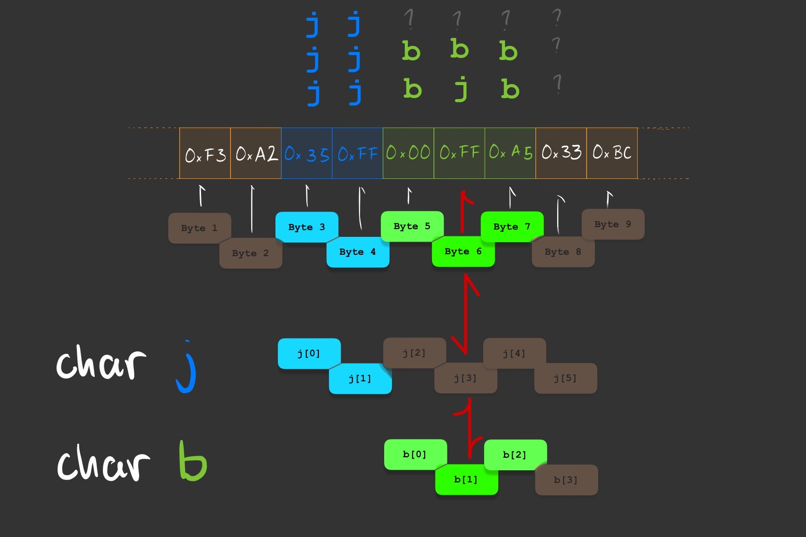

# C / C++ errors and concepts

<details>
<summary>

</summary>
<br> 

</details>


- [section: pass by reference vs. pass by value #26](https://github.com/deliaBlue/laPrepa/issues/26)
- [section: Handling errors #25](https://github.com/deliaBlue/laPrepa/issues/25)
- [section: dynamic memory allocation #24](https://github.com/deliaBlue/laPrepa/issues/24)


# Memory Allocation

Developing an understanding of how to store and manipulate information is one of our primary aims as programmers. Variables, pointers, references, functions, etc... - these are all just ways of organizing and managing data. Within the context of C / C++, we can begin to develop an understanding of how these abstract things behave by understanding how they are related to memory. 

Over the next academic year, you will become more intimately familiar with these concepts since you **will have to deal with the issues they present**.  This section will introduce some rudimentary concepts relating to memory (contextualized in the framework of C / C++) to help you start developing
your own mental model of what is happening within your code.

## Variables, Declaration, Initialization, and Assignment
Amongst the code you've had to read / write in these sessions, you've been using variables. Regardless of the programming language you are using, being able to name values so that you can modify and manipulate them is unbelivably useful.


Declaring, initializing, modifying, comparing, assigning - these are just some of the actions you've taken with the value/s stored within the variables you have been using.
Since C / C++ are not memory safe, you have to be conscious of what it is
you are doing when you are declaring a variable, or when you are assigning
a value to it, or adding to it, etc...


So how should we conceptualize what we are doing? Lets first get 
familiar with **memory** as it relates to **declaration**, 
**initialization**, and **assignment**.
**From here on out we are not going to be pedantic. These descriptions
are simplified and abstracted away for the sake of clarity, not accuracy.**

### Memory as it relates to variables

Memory can be thought of as a region of your computer capable of storing 
information. For our purposes, imagine a finite sequence of 0’s and 1’s.
When your program begins to execute, it is given some memory - some 0’s and 1’s 
it can use for its own temporary storage of information. 
Note that this memory already contains data which is just random
[^why it isn’t just random] and not particularly useful. 


So we have places where we can store information, which leads us to the
concept of **memory addresses**.  Your program can read and write onto the memory it has been given, and it will interpret the infromation stored there in whatever way you tell it to.
But the program needs to know where the information is located!
In the image above, we've named 'Byte 1', 'Byte 2', [...], 'Byte 9' and we need
something analogous to this so that the computer can identify which regions in 
memory to access.

Just like street addresses are some abstraction we use in the real world - a name
that corresponds to the location of a place - **memory locations** can be refered 
to via **addresses**!
This is known as a memory address, and its just what the name implies, a name for
a location in memory.

Whatever random data was held in memory before your program executes isn't
particularly useful for our purposes[^reading privileged information]. 
If we want to store specific information - i.e if we want to store the value of
an integer, or a string of characters, or anything at all - we have to know 
where we're storing it. 

SHOW PYTHON ERROR VARIABLE BEFORE ASSIGNMENT
SHOW C / C++ ERROR VARIABLE DECLARED BEFORE ASSIGNMENT

<details open>
<summary>

### Declaring a variable

</summary>
<br> 

When we declare a variable, we are associating whatever **name** we've 
provided with some **value**. Lets see an example:

```c++
int main(){
    int year;           // <--- Declaring a variable of type int
    year = 1342;        // <--- Assigning/Initializing the value of the variable
}
```

We are using the name **year** in our code to mean 'some integer I will 
reference as **year**' - in other words we are associating a **name** and 
a **value**. 
When this program is executed, this variable is simply the name we've given
to some region in memory - **year** is 
a custom name we've given to some memory location!


Lets visualize how we are **naming** a region in memory, and later on
we'll look at what **assigning a value to it** would look like given 
the following code:

```c++
int main(){
    char a[4];      // <- visual aid represents this line
    a = "yes";
}
```


`Note that there already is data inside of 'a'. Where did it come from?`


</details>


### Initializing and assigning data to a variable

We've declared a variable, in turn the compiler has allocated as much memory as
we've specified or as much memory as is default. In our case, we've specified 
that **a** is an array of 4 chars (meaning each `block` contains 1 byte since
chars have that size ) 
ergo 4 bytes will be allocated to variable **a**.

We would say that this region in memory is uninitialized because the compiler
has simply associated a user defined variable name with a memory region. We
now have to write onto that region in memory by initializing/assigning a value
onto our variable - otherwise we'll just have whatever garbage value/random bits 
were previously held in those memory locations (foreshadowing).

<details>
<summary>

#### What would happen if we printed the contents of 'a' before it is initialized?

</summary>
<br> 

Try it! Create an empty string and print its content. You will get a random set of characters, maybe a few of these '�' will appear because the compiler interprets the bytes in `a[i]` as characters result in an "an unknown, unrecognised, or unrepresentable character".

</details>

To reiterate, **C / C++ do not have default values they assign to your variables
whenever you declare them**. You need to initialize them.
In other words, this code in C++ has **undefined behaviour** because the value 
of **a** will not always be the same:

```c++
#include <iostream>
int main() {
    int a;
    a = a + 5;
    cout << a << "\n";
    return 0
}
```

Meanwhile this Python code does have defined behaviour because the value of 
**a** will always start of as 0

```python
def main():
   a = int() 
   print( a )

if __name__ == "__main__":
    main()
```

Although the python example might seem a little contrived (one wouldn't 
typically initialize an integer that way), it highlights the idea that 
the code written in C++ or the analogous version in C do not initialize
variables for you.
So how could we conceive of the act of initialization/assignment?


Well a starting
point would be the **rewriting of that region of memory** with some value that
was either input or hard coded into our code.

Consider the following visual aid that follows from the declaration of variable
**a** :

```c++
int main(){
    char a[4];
    a = "yes";      // <- visual aid represents this line
}
```


#### Why do I have to care about type? Why isn't it like Python?


The following is a perfectly reasonable thing to do in Python:
```python
a = None
a = ['this', 'is', 'really', 'useful']
a = 5
```

But this isn't the case in C or C++, we can't reassign variables so readily
because we are workingin a statically typed language 
[^garabage collection, dynamic].

~~


### Datatypes and Casting
At this point, it should be abundantly clear: we are working with data stored
in memory. Memory is just some assortment of bytes that we write to and read
from **in a particular way**. This 'particular way' in which we read and write 
data in memory is what will determine the value the data is interpreted as 
once it is retrieve.

```c
#include <stdio.h>

int main() {
    char a[] = "yes";
    int  b[] = {121, 101, 115};
    
    for ( int i = 0; i < 4; i++ ){
        printf( "block %i char a: %c\n", i, a[i] );
        printf( "block %i char b: %c\n", i, b[i] );

        printf( "block %i int a: %i\n", i, a[i] );
        printf( "block %i int b: %i\n", i, b[i] );
        
        printf("\n");

    }
}
```

Pay special attention to how we are printing things. We are using '%c' and '%i'
, ostensibly saying "interpret whatever is in `variable_name[i]` as a 
**name_of_datatype**".

Casting is the act of explicitly converting one datatype into another. When you use %c for an int, you're performing an implicit cast, telling the program to read the data as if it were a char. Note that the underlying data isn't changed; what changes is how the program interpreates it. 

Casting can be dangerous if not done carefully, as you risk misinterpreting the data, leading to bugs that can be difficult to diagnose. This is something you should have in mind when operating on floats and integers, because the set of operations that they can do together might become a problematic. Consider the following situation where we want to calculate the ratio between the distances of two atoms (like those you would find in a .pdb file!):

```c++
#include <iostream>

using namespace std;

int main() {
    int distance1 = 1;
    int distance2 = 100;
    float ratio;

    // Incorrect calculation: integer division truncates result to zero
    ratio = distance1 / distance2;
    cout << "Incorrect ratio: " << ratio << endl;       // <-- prints 0

    // Correct calculation: type casting before division
    ratio = static_cast<float>(distance1) / distance2;
    cout << "Correct ratio: " << ratio << endl;         // <-- print 0.01

    return 0;
}
```

```console
dbj@dbj:~$ g++ distance.cpp -o distance.x
dbj@dbj:~$ ./distance.x
Incorrect ratio: 0
Correct ratio: 0.01
```

As we can see, the division between integers results in an integer itself, which 'truncates' the result to 0 thereby generating an incorrect result. By casting one of the integers as a float (`static_cast<float>(distance1)`) we can resolve this issue in a really straightforward manner! Note that no error is raised **because the division between integers returning an integer is perfectly valid**, we just have to understand that behaviour!

<details>
<summary>

#### What is variable_name[i]? 

</summary>
<br> 
As a reminder, indexing some variable like `variable_name[i]` will return
the value of the i'th block of `variable_name`. Note that we are saying 
the **value**, we are not (nor should we) deal with raw bytes.


**b**[i] will be 4\*i bytes away from b[0] where the 0s and 1s
for each block of bytes are representing an integer

**a**[i] will be 1\*i bytes  away from a[0] where the 0s and 1s for each block are representing a char

</details>


### Buffer Overflow
If you ever feel confused by what something means, look at the definition.

This is especially pertinent in computer science **because things have names for
a reason**. 

> Buffer: "a section of computer memory for temporarily storing information" 
> Overflow: "to flow over the brim of" 

Buffer Overflow refers to the phenomena where data that was supposed to reside
in a region of computer memory overflows into adjacent memory. Lets look at an
example to see why **understanding how memory works helps us understand 
unexpected behaviour**

Lets consider the follwing code:

```c
#include <stdio.h>

int main() {
    char j[2] = "jjj" ;

        printf( j );
        printf("\n");

        for ( int i = 0; i < 6; i++ ){
            printf( "%i \n", j[i] );
        }
        printf("\n");

    char b[3] = "bbb";

        printf( b );
        printf("\n");

        for ( int i = 0; i < 6; i++ ){
            printf( "%i\n", j[i] );
        }
        printf("\n");

    j[3] = 'j'; // <-- THIS SHOULD NOT BE MODIFYING b
        
        printf( b );
        printf("\n");

        for ( int i = 0; i < 6; i++ ){
            printf( "%i\n", j[i] );
        }
        printf("\n");
}
```

This code results in the following:

```console
dbj@dbj:~/new_repo/code_snippets$ gcc char_arr.c -o char_arr.x

    ERRORS NOT RELEVANT 
    FOR THE PURPOSES
    OF THIS EXAMPLE

dbj@dbj:~/new_repo/code_snippets$ ./char_arr.x 

     j   j  � � � �
     j   j  b b b � 
     j   j  b j b �
    
 𝐣:  0   1  3 4 5 6  ..
     └───┘
 𝐛: -2  -1  0 1 2 3  ..
            └───┘
--------------------------

     jj  bbb bjb
     
     106 106 106
     106 106 106
     ..0 .98 .98
     ..0 .98 106
     ..0 .98 .98
     ..0 ..0 ..0
```

There are three things to higlight with this example (see image for more context):


First, notice that our code is printing from j[0] to j[6] - since `j` and `b` are adjacent to each other, we see their contents interpreted as integers in each of the for loops.

Second, notice that our first initialization of `j` assigned the string "jjj", but when we print the contents of `j` we only get "jj" and when print the bytes from j[0 .. 6] only the first two seem to have been assigned. As shown in the image, only j[0] and j[1] are regions of memory that the compiler has dedicated to our `j` string variable, this is because we declared `j` to be a string of length 2 as seen by the first declaration `char j[2];`. Thus, there is no assurances that the third position (corresponding to j[2]) would contain whatever value it was assigned.


Third, notice that after executing line `j[3] = 'j'` we see that `b` has changed from "bbb" to "bjb" where `b[1]` was modified. This is buffer overflow! We've managed to flow over the limits of `j` into a region of memory that belongs to `b` where j[3] corresponds to b[1]. This demonstrates the that you have full autonomy over how memory is used within your program, and should serve as a reminder that variables are just pointing to some region in memory.


## Pass by Reference vs. Pass by value

One of the most effective ways to speed up our programs is by considering how and when our program accesses the devices memory. We want to minimize the amount of information that we need to read/write (or worse still, fetch from secondary memory) because it is a computationally expensive thing to do.

Lets see a rudimentary example in Python and C++ to understand why effective memory usage can
make or break the efficiency of a program.

Consider some code that resolves the following problem.
`Generate the reverse complement of a DNA sequence from start codon to end codon.` 

> If no coding sequence is present, print 'No coding seq found'.
> Input will be a non-empty string, if a start codon is present an end codon will be present in the appropriate reading frame`

```python
from sys import stdin

def rev_complement( inp_string ):
    rev_comp = ""
    print( inp_string )
    comp = dict()
    comp['A'] = 'T'
    comp['C'] = 'G'
    comp['T'] = 'A'
    comp['G'] = 'C'
    
    for nucleotide in inp_string:
        rev_comp += comp[nucleotide]
    
    return( rev_comp ) 
         
def main():
    print('Input DNA seq')
    initial_seq = stdin.readline().strip()
    rev_comp = rev_complement( initial_seq )
    print( f'The reverse complement is "{rev_comp}"' )


if __name__ == '__main__':
    main()
```
 
```c++
#include <algorithm>
#include <iostream>
#include <string>
#include <map>

using namespace std;

string reverseComplement( string input_seq );

int main(){
    string seq;
    string reversed_seq;   // not_in_camel_case !

    cout << "Input DNA seq\n" ;
    cin >> seq;
    //seq = "AAAAAAAA";
    reversed_seq = reverseComplement( seq );
    cout << "The reverse complemnt is \"" << reversed_seq << "\"";

}

string reverseComplement( string input_seq ) {   // camel case is convention in C++ !
    map< char , char > complement;

    complement[ 'A' ] = 'T';
    complement[ 'T' ] = 'A';
    complement[ 'C' ] = 'G';
    complement[ 'G' ] = 'C';

    string reverseStr;

    for (int i = 0; i < input_seq.length(); i++){
        reverseStr += complement[ input_seq[ i ] ];
    }

    reverse( reverseStr.begin(), reverseStr.end() );

    return( reverseStr );
}
```

We want to highlight two issues with this implementation. 

First and foremost, notice that we are storing some input into a variable of 
type string (`seq`). Then, we invoke the `reverseComplement` function by calling
`reverseComplement( seq );`. 

This is an example of variable passing (i.e argument passing) known as `Pass By Value` 

The parameter of function `reverseComplement` is a string datatype, and
we are 'passing' data by calling the function with some value 
`reverseComplement( some\_value )` - in our case, some_value is string `seq`. Calling this 
function which receives the value of variable `seq` will declare a new variable 
(reverseComplement's `input\_seq`) and it will initialize this variable with the value
that was passed as argument in the function call. This variable is only available
within the scope of the funciton[^stack_function_frames] and will no longer
exist after the function call is terminated. 

We are declaring a variable of the same type, initializing it with the same
value, available within the scope of the function - we are making a copy!

And that's the problem, sometimes we might generate the appropriate 
results without requiring a copy of the data to be passed into a funciton.
This is where we get to the wonderful world of pointers, and references!
As you already know, variables are just names that indicate where some 
memory is, and how it should be interpreted by default. So, instead of making a copy of
the value of some variable, we could instead just indicate where 
the value of the variable is located (i.e we can just pass the memory 
address).

This is where `references` and `pointers` come in handy.

#### References & Pointers

When you pass a parameter by value, like `seq` in reverseComplement(seq), the function creates an internal copy of that parameter. This is a separate instance that has the same value as the original variable `seq` but is completely independent of it. Any changes you make inside the function will not affect the original variable `seq`. This can be inefficient for large data structures because it involves copying all the data.

Pointers are a datatype that do **precisely what their name suggests**. They literally "point" to a location in memory. A pointer stores the memory address of another variable. For example, if you have variable `seq`, then a pointer `ptr\_to\_seq` could hold the memory address of `seq`. This pointer can then be passed to a function, which can be dereferenced to access or modify the original variable `seq`.

References are like nicknames or aliases for a pre-existing variable. When you declare a reference, you're saying, "I want to refer to this memory location using another name." From that point on, both the original variable and the reference can be used interchangeably. This also means that if you modify the reference, you are in essence modifying the original variable.

> **Note**
> In an expression, `&` denotes the address-of operator, which returns the address of a variable.
> When & is used in a declaration (including function formal parameters), it is part of the type identifier and is used to declare a reference variable (or reference or alias or alternate name). It is used to provide another name, or another reference, or alias to an existing variable.

Why is Pass by Value Default?
In essence, because that default behaviour prevents unintended modifications to
original values and simplifies memory management. Additionally, pass by value is
generally more efficient than pass by reference when copying small-sized 
datatypes.


So, we can rewrite the original code as follows, which will prevent our string from being copied EVERY TIME THE FUNCTION IS CALLED because instead of passing the value of the variable, we are passing the value of the reference:

```c++
#include <algorithm>
#include <iostream>
#include <string>
#include <map>

using namespace std;

string reverseComplement( string & input_seq );

int main(){
    string seq;
    string reversed_seq;

    cout << "Input DNA seq\n" ;
    cin >> seq;
    //seq = "AAAAAAAA";
    reversed_seq = reverseComplement( seq );
    cout << "The reverse complemnt is \"" << reversed_seq << "\"";

}

string reverseComplement( string & input_seq ) {
    map< char , char > complement;

    complement[ 'A' ] = 'T';
    complement[ 'T' ] = 'A';
    complement[ 'C' ] = 'G';
    complement[ 'G' ] = 'C';

    string reverseStr;

    for (int i = 0; i < input_seq.length(); i++){
        reverseStr += complement[ input_seq[ i ] ];
    }

    reverse( reverseStr.begin(), reverseStr.end() );

    return( reverseStr );
}

```

Lets see a very basic model that could be helpful. Consider a function `foo( param\_a )` that receives some string and returns its length. The following would correspond to the sequence of steps that would transpire if we used pass by value:


On the other hand, we could conceptualize what is happening when we pass by reference as follows:


As we can see, the latter does not have to spend as much time copying each element of string `a` into the `foo`'s private copy, and therefore would be more efficient. 

> **Note**
>  These images are not intended to be an accurate representation of how memory is allocated, but rather provide some intuition as to why copying things when it isn't necessary wastes precious resources. Rember that each time things are being copied, those are CPU cycles that are being used to copy that data. So remember that your choices matter - if you use pass by value or pass by reference, it will have consequences on how your programs run!


Useful Resources expanding on pass-by-reference and pointers:
https://www.ibm.com/docs/en/zos/2.4.0?topic=calls-pass-by-reference-c-only
https://www3.ntu.edu.sg/home/ehchua/programming/cpp/cp4_PointerReference.html#zz-2.1
https://icarus.cs.weber.edu/~dab/cs1410/textbook/6.Functions/value.html

# Handling Errors

Ideally, programming would require little more than a problem, some ingenuity in figuring out how to solve it, and writing out some code that does what it ought to do to solve the issue at hand. 
It is on this statement - “does what it ought to do” - that most difficulties in implementation arise. We typically believe we know what the intended behavior is way sooner than we should.

Before we enter the minutia of how to interpret and understand errors within the context of C / C++, you should consider that the hardships of making something do what it ought to do typically emerge from one of the following:

- You have misunderstood the nature of the problem
- You have misunderstood the nature of your solution

We will deal primarily with the latter of the two situations. Our aim is to develop a basic understanding of the particularities of C / C++ within the context of your 2nd academic year, specifically what the error messages you'll encounter reveal about the code you’ve written and what concepts are useful to become better debuggers.

> Debugging is twice as hard as writing the code in the first place. Therefore, if you write the code as cleverly as possible, you are, by definition, not smart enough to debug it.
> 
> 
> Brian W. Kernighan.
> 

### Format of this section:

`file_name.cpp`
```c
// Some code in C or C++

int main(){
    cout << "Hello World!\n";
}
```

<details open>
<summary>

#### Compilation & Output

</summary>
<br>

```console
dbj@dbj:~$ g++ file_name.cpp -o file_name.x
file_name.cpp: In function ‘int main()’:
file_name.cpp:2:5: error: ‘cout’ was not declared in this scope
    2 |     cout << "Hello World!\n";
      |     ^~~~

```

</details>

<details open>
<summary>

#### Expected Compilation & Output

</summary>
<br> 

```console
dbj@dbj:~$ g++ file_name.cpp -o file_name.x 
dbj@dbj:~$ chmod +x file_name.x  # technically not necessary - file_name.x is already executable
dbj@dbj:~$ ./file_name.x
Hello World!
dbj@dbj:~$
```

</details>


<details open>
<summary>

#### Concepts related to issue at hand

</summary>

##### Libraries & Scope

You've probably written a python program importing some function/class from some library[^lib], where you've had to include a statement along the lines of `import sys` or `from sys import stdin`.

These statements are making whatever functions you specify **visible and accessible** within your program [^1] - which is another way of saying that you are including the functions within the global **scope** [^scope] of your program. In this particular case, the `import` statement ensures that whenever the python interpreter reads 'sys.stdin.readline()' or 'stdin.readline()', it **knows what the function `readline()` is** since you've specified where the function is defined (some module called sys). 

You are **including** all functions associated to the module sys within the scope of your python script, importing them from some file in your computer[^file_py].

In C and C++, any operation that requires reading from standard input (stdin) or printing to standard output (stdout) requires the use of an external library (**no `print()` nor `input()` without any imports like in python!**). 

In our case, we are using `cout`, which is part of the `iostream` library. In python we used the statement `import`, but in C and C++ we would use the statement `#include` followed by the name of the library/header file [^header_files] which contains our functions of interest!
Remember, importing/including simply gives you **access to some already existing repository of code**.


</details>


<details open>
<summary>

#### Solution

</summary>
<br> 

```c++
#include <iostream>

int main(){
    std::cout << "Hello World!";
}
```

</details>


---
We urge you to try to understand the error before reading the concepts related to the issue at hand to see if you can identify the problem. 

Before reading the solution/alternative code see if you can figure out what the intended behavior, and modify the code appropriately so it does what it ought to do.

    
## Compile-Time

The computer **`can’t`** translate your source code into an executable file.

```c++
#include <iostream>

int main() {
    char myChar = "a";  // Fails at compile-time

    std::cout << myChar << std::endl;

    return 0;
}

```

```console
dbj@dbj:~/new_repo/code_snippets$ g++ compile_time_fail.cpp -o compile_time_fail.x
compile_time_fail.cpp: In function ‘int main()’:
compile_time_fail.cpp:4:19: error: invalid conversion from ‘const char*’ to ‘char’ [-fpermissive]
    4 |     char myChar = "a";  // Fails at compile-time
      |                   ^~~
      |                   |
      |                   const char*

```

This error demonstrates how the use of " and ' differs. We could conceptualize " as indicating some string (i.e some array of chars as denoted by the asterisk following char) whilst ' would imply an individual char.  Thus, when we declare myChar as a char, not an array of chars, we get a compile-time error C++ does not allow us to assign a string literal to a char.


```c++
```


Now lets put it all together, and lets debug this code by looking at the error messages themselves.

```c++
                                        // missing header #include <algorithm>
#include <iostream>
#include <string>
#include <map>

using namespace std; 

string reverse( string input_seq );    // <-- namespace clash w/ std::reverse & pass by value

int main(){
    string seq; 
    string reversed_seq; 

    cout << "Input DNA seq\n" ;
    cin >> seq;
    //seq = "AAAAAAAA";
    reversed_seq = reverse( seq );
    cout << "The reverse complemnt is \"" << reversed_seq << "\""     // <-- where ; @?

}

string reverseComplement( string & input_seq ) { // <-- pass by ref (not consistent ^^^)
    map< char , char > complement;
    
    complement[ "A" ] = "T";    //  <-- using " instead of ' when map uses chars not str!
    complement[ "T" ] = "A";    //  <-- using " instead of ' when map uses chars not str!
    complement[ "C" ] = "G";    //  <-- using " instead of ' when map uses chars not str!
    complement[ "G" ] = "C";    //  <-- using " instead of ' when map uses chars not str!

    string reverseStr;
    
    for (int i = 0, i < input_seq.length(), i++){       // <-- where the ; @?
        reverseStr += complement[ input_seq[ i ] ];
    }
    
    reverse( reverseStr.begin(), reverseStr.end() ); 

    return( reverseStr ); 
}
```


## Run-Time

The computer `**can**` translate your source code into an executable file. The computer executes the program, but before it has finished something `**fails**`.

We've provided an example that works for most cases, but fails in particular string inputs. Could you figure out which?

```c++
#include <iostream>
#include <string>
using namespace std;

float calculate_gc_content(string& sequence) {
    int gc_count = 0;
    int total_sequence = 0;

    for ( int i = 0; i < sequence.length(); i++) {
        if (sequence[i] == 'G' || sequence[i] == 'C') {
            gc_count++;
        }
        if (sequence[i] == 'G' || sequence[i] == 'C' || sequence[i] == 'A' || sequence[i] == 'T') {
            total_sequence++;
        }
    }

    return gc_count / total_sequence;  
}

int main() {
    string dna_sequence = "AATGCGGG";  
    float gc_content = calculate_gc_content(dna_sequence);
    cout << "GC content: " << gc_content << endl;  
    return 0;
}

```
The output of 'AATGCGG' is the following:
```console
dbj@dbj:~/new_repo/code_snippets$ g++ GC_content.cpp -o GC_content.x
dbj@dbj:~/new_repo/code_snippets$ ./GC_content.x 
GC content: 0.625
```

Instead of AATGCGG try an empty string by modifying this code, what will happen?

Yes! It's a 'division by zero' error. Since 0 / 0 is not a valid floating point operation, an aptly named floating point exception error has occured! Again, you are not supposed to know this, but a quick google search (literally copying and pasting "Floating point exception (core dumped)" into a search engine) reveals that these errors are related to invalid operations that are done on floating point numbers.

```console
dbj@dbj:~/new_repo/code_snippets$ g++ GC_content.cpp -o GC_content.x
dbj@dbj:~/new_repo/code_snippets$ ./GC_content.x 
Floating point exception (core dumped)
```

What would be a solution to this? One possibility would be to simply check whether the sequence is of non-zero length before we enter the body of the function.

```c++
#include <iostream>
#include <string>
using namespace std;

float calculate_gc_content(string& sequence) {
    if (sequence.length() == 0){    // <--
        return 0;                   // <--
    }                               // <--

    int gc_count = 0;
    int total_sequence = 0;

    for ( int i = 0; i < sequence.length(); i++) {
        if (sequence[i] == 'G' || sequence[i] == 'C') {
            gc_count++;
        }
        if (sequence[i] == 'G' || sequence[i] == 'C' || sequence[i] == 'A' || sequence[i] == 'T') {
            total_sequence++;
        }
    }

    return gc_count / total_sequence;  
}

int main() {
    string dna_sequence = "AATGCGGG";  
    float gc_content = calculate_gc_content(dna_sequence);
    cout << "GC content: " << gc_content << endl;  
    return 0;
}
float calculate_gc_content( string& sequence ){

```

### Semantic Errors
Sometimes a program will not give any indication that something has gone wrong. It will compile without warnings, it will execute, and it will gracefully exit. It is up to you as a programmer to be aware of the desired behavior of your code.

Try to find the error in the following code snippet, deducing what the intended behaviour of the function was.

```c++

#include <iostream>
#include <string>

using namespace std;

int calculate_G_content( string dna ){ 
    
    int g_count = 0;
    for ( int i = 0; i < dna.length(); i++ ) {
        if ( dna[i] = 'G' ) g_count++;
    }
    return( g_count ); 
    }

int main() {
    string dna = "ATGCGTAA";
    int g_content = calculate_G_content(dna);
    cout << "Guanine's observed: " << g_content << endl;
    return 0;
}

```

Did you catch it? We are trying to count the number of 'G' chars in a string, but we seem to be overshooting and counting every char as if it were 'G'. 
The problematic line is `if ( dna[i] = 'G' )` but could you tell us why?

When the program is executed, this line of code seems perfectly reasonable to the compiler. We are using `=` instead of `==` here, but why isn't this showing up as an error? In c++, the assignment operation returns the value of the thing being assigned. For example:

```c++
    #include <string>
    #include <iostream>
    
    using namespace std;
    
    int main(){
        int i;
        cout << (i = 22) << endl; 
    
        string dna = "AAT";
        cout << ( dna[1] = 'r' ) << endl;
    }
```
When this code is compiled and executed, the following occurs:

```console
dbj@dbj:~/new_repo$ g++ example_assignment_nonzero.cpp -o example_assignment_nonzero.x -Wall
dbj@dbj:~/new_repo$ ./example_assignment_nonzero.x 
22
r
```

As we can see, the assignment operation simply returns the value of whatever is being assigned. Remember that 0 is false and everything else is true. When we evaluate `if ( dna[i] = 'G' )` it's as if we are evaluating `'if 'G'`,  which is true because the char 'G' is non-zero! So our problematic implementation silently converts all elements of `dna` string into 'G''s whilst the if statement is evaluated as true. No error is raised because this is perfectly reasonable code, it just isn't doing what you want it to!

This is just to remind you that semantic errors are a pain, because they require you to notice something in your code that you will probably gloss over multiple times. 

You should be wary of syntax - you ~~may~~ will have missed something.


# Time to practice

Given this rudimentary introduction into C / C++ concepts relating to memory, and a brief introduction into the error messages themselves, try to complete the following Jutge problems paying special attention to the error messages that may appear along the way.

If you're up for it, generate a recursive and a non recursive solution to these problems.

[Chess Tournament][https://jutge.org/problems/X38550_en]
![Square Every Digit][https://www.codewars.com/kata/546e2562b03326a88e000020]
![Floating Point Comparison][https://www.codewars.com/kata/5f9f43328a6bff002fa29eb8]


[^lib]: Note that ANY PYTHON FILE can be imported, so you can import whatever file you want! On a similar note, have you wondered why we include `if __name__ == '__main__':` within our code? At a practical level, it has to do with how python imports modules - essentially, we want to differentiate from situations where we execute a file versus when we import the file and initialize it. Please watch the 4 minute video 'https://youtu.be/sugvnHA7ElY' if you're interested!

[^file_py]: These files are stored at `/usr/lib/python` if you want to have a look! (they may be distributed in different versions of python, feel free to take a look at them through vim!)

[^header_files]: These files are located in `/usr/include/`

[^scope]: "Function-definition scope. Scope is the location in a program where a name is visible and accessible" - Weber State University, Computer Science 1410 6.2.2 Functions and Variable Scope


[^stack_function_frames]: When a function is called, memory for local variables is allocated on the stack, and when the function returns, that memory is deallocated. This means that the local variables' values are no longer available or accessible once the function exits, and any attempt to access them after the function call has completed will lead to undefined behavior.
